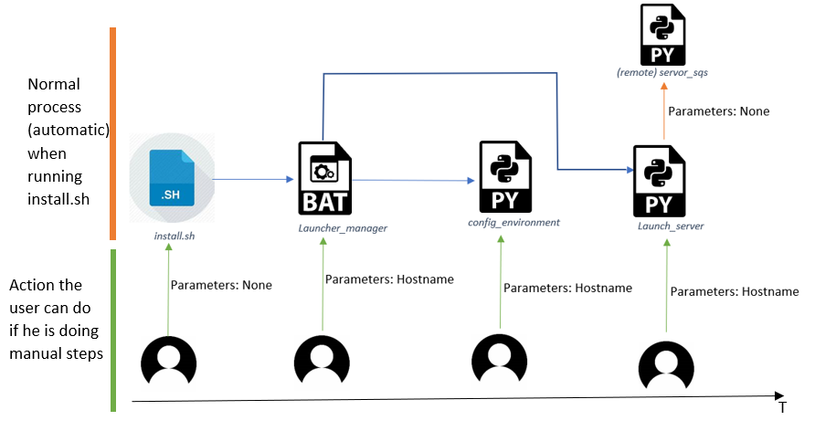

Richard DROGO - Pierre GIRAUD - Cédric GORMOND - Audric MERLEY - Arnaud TAVERNIER

# Project LAB3 TEAM 8

 
## Context

The project is to create a server on an AWS instance and communicate with it via a client on our computer. The processes that the server can do are:

- Analyse a set of number and send results (mean, min, max , median)
- Image processing with threshold and grey scale on image

In both cases, the server will write operation log files on a bucket, and the resulting images when doing image processing.

For this project, we try to make it automatic for every step.

The steps are the setup of an AWS instance, the installation of the python libraries on the server, the configuration of the AWS-cli on the server and the launching of the server script (`servor_sqs.py`).

The full automation was successful, except for one thing: when configuring the AWS-cli on the server, the program needs to be given manually the path of the credentials client-side.

 
## Requirements

You need to install Python3 (check it with `python3 –-version`) and aws-cli/2. (`aws –-version`).

Libraries needed:

- Pillow (for image processing) `pip install pillow`
- Boto3 (sqs and bucket handler) `pip install boto3`
- Paramiko (SSH and SFTP) `pip install paramiko`

Additionnal tools needed:

- You need to be able to run shell script (on Windows you can use Git bash or MinGW for example).

Provided all of those, just run the shell script `install.sh` and watch the server being created automatically !

  
## Video presentation

https://drive.google.com/file/d/1SO-HFNSwIB3bj4aB6oyLbOK0sMCQB8pz/view?usp=sharing

  
## Technologies used

- Technologies from AWS :
  - EC2 to create instances, security-group and a private key
  - S3 Bucket to store logs and modified images
  - SQS to handle communication between the server and the clients
    - requestQueue for the server to receive data
    - responseQueue for the server to send the answer to the clients
  - AWS-CLI : to create and retrieve data from the AWS service.
- Other technologies:
  - SSH with library paramiko to communicate with the instance. Used mainly to download the different libraries and configure aws-cli on the server side.
  - SFTP with library paramiko to transfer files like the server script.
  - Image processing with Pillow

##Languages used:

- Python for most of the script : server /client
- Shell script for installation
- Batch for side operations

  
## Project Architecture

Main files :

| **Name** | **Type** | **Technologies used** | **Description** | **Arguments** | **Automatic** |
| --- | --- | --- | --- | --- | --- |
| **install.sh** | SHELL | AWS-cli | Use to generate/load an instance on aws. This instance will be used as a server after that. If a security-group key or an instance already exist, it will re-used. | No | Yes |
| **launcher\_manager.bat** | BAT | None | Will be used to launch config\_environment and Launch\_server.py | 1 : Hostname of the remote instance | yes |
| **config\_environment.py** | PYTHON3 | SSH, SFTP | Install and configure everything that we need on the remote instance and update credentials on the server side. If an installation already exists, it will just update the credentials. It will use ssh to send commands to the server and sftp to transfer files to the server | 1: Hostname of the remote instance | Almost: A question will be asked for the path to your credentials |
| **launch\_server.py** | PYTHON3 | SSH | Handle server launch on remote instance. Will kill others processes and start the server. Will display the output of the server. Will use SSH to get the output and send command to kill processes. | 1: Hostname of the remote instance | Yes |
| **server\_sqs.py** | PYTHON3 | Pillow, boto3 | Will receive requests through SQS requestQueue, do some processing and send the response back to the clients by using the responseQueue. Will upload the logs and modified images to a bucket. Can do image processing and arithmetic operations. | No | Yes |
| **client\_sqs.py** | PYTHON3 | Pillow, boto3 | Client that will send a request through requestQueue and get the answer via responseQueue. Can ask for image processing or arithmetic operations (means, min, max, median) | You can write commands directly as options (like `client\_sqs.py -t 25 -s 1 2 3 6`) | No |

 
## Instruction: What to do

Steps :

1. Get your account details and copy them to your credentials (C:/User/%USERNAME%/.aws)
2. Launch `install.sh` (with a shell console)
    - It will manage everything to make an instance run.
3. Install.sh will **automatically** launch `launcher\_manager`. If at one point you want to run it manually, you can by adding one parameter which is the hostname of your AWS instance.
4. Launcher\_manager will **automatically** launch `config_environment.bat`. This script will start a python console with an SSH connection to install and configure every libraries server-side. Again to run it manually, you need pass it the hostname of your AWS instance.
    - A question will be asked : put the path to your credentials (to create secure connection)
5. Launcher\_manager will **automatically** launch `launch_server.py` which will launch and display output of the remote instance. Again to run it manually, you need pass it the hostname of your AWS instance.
6. At this point you can run `client_sqs.py` and work with the server.
7. If you quit the instance, close the server, or just made a mistake, you can just re-run `install.sh. It will re-use averything previously installed.

Please be careful : a private key file will be generated in the folder. Please do not delete it as it is impossible to re-create it whithout performing a complete re-installation.

The figure below is showing the relationships between files.

 

## Python client   

The client is used to send requests to the server thanks via SQS. We can call :

client\_sqs.py [command] [value] [command] [value]…

or

client\_sqs.py
>[command] [value] [command] [value]

>[command] [value] [command] [value]

| Commands | Argument | Description |
| --- | --- | --- |
| -h –help help | None | Display this help |
| -t –timeout timeout | 1 : the time in second | To modify the value (second) of the timeout. Used after sending a request. By default: 10 sec |
| -c –clear clear | None | Use to clear responseQueue and requestQueue. Useful if there are too many messages stored in the queues (will increase process time) |
| -b –bucket bucket | 1: name of the new bucket | Sets the name of the bucket where images will be stored. Can be used if a distant client is used and doesn&#39;t have access to config.txt. |
| -s –send send | N (at least 1) numbers separated by spaces (-s 1 2 5 6 3 8 25 6 5) | Request the server to perform arithmetic on the input numbers. It will display the result (which will be also stored in a log file in a bucket server-side) |
| -n –nvg nvg | 2: <Source\_path> on your computer <File\_name> for the modified image on the bucket | Will upload the image on the bucket, and request the server to convert it to greyscale, then upload it on the bucket. It will send the result 1 or 0 to the clients depending if it was a success or not |
| -thl –threshold threshold | 2: <Source\_path> on your computer <File\_name> of the modified image on the bucket | Will upload the image on the bucket, and request the server to perform a threshold on it (for every channel, each pixel is 0 if < 125 and 254 if > 125), then upload it on the bucket . It will send the result 1 or 0 to the clients depending if it was a success or not |

## Issues encountered:

One of the biggest trouble was the bucket management, as bucket name need to be unique between AWS users. The solution found was to create a `configure.txt` file when launching the server which would store a randomly generated bucket name. This file is then sent to the server, and used in following operations. If the client is on a remote computer without the good `configure.txt` file, you can configure it manually with the command -b.

Another trouble was the configuration of AWS and the python environment on the remote server, as it was needed to configure a python virtual environment on Linux.

Eventually, when an instance is starting, we cannot connect directly with a SSH connection. We need to wait for at least 10 more seconds for the instance to start completely.

 
## What we learnt

We learnt a lot thanks to this project. It was of our biggest python projects. We familiarized with shell and aws-cli in depth. Finally, we discovered that using SSH, SFTP and SQS was useful to make services work well with one another.